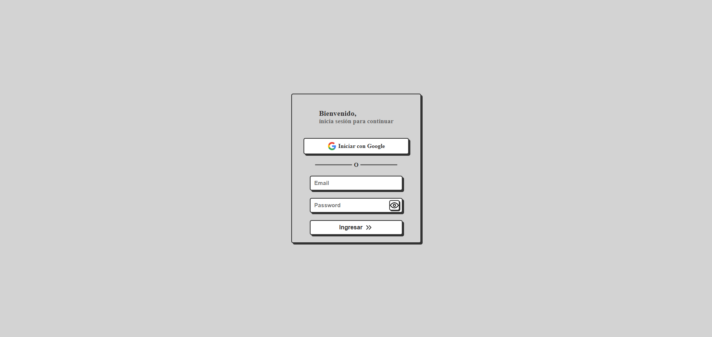
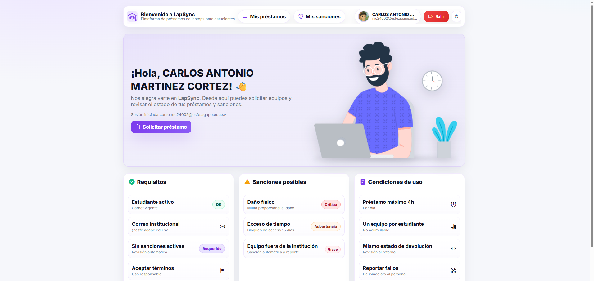
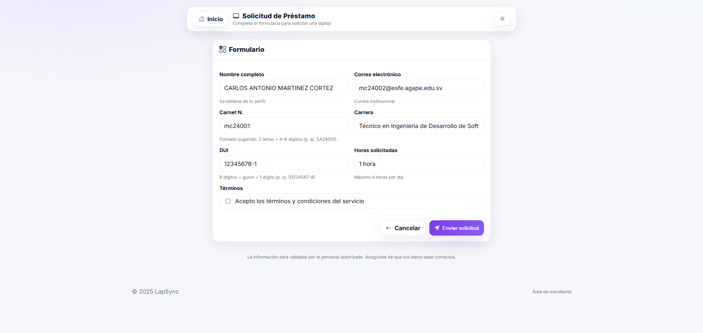
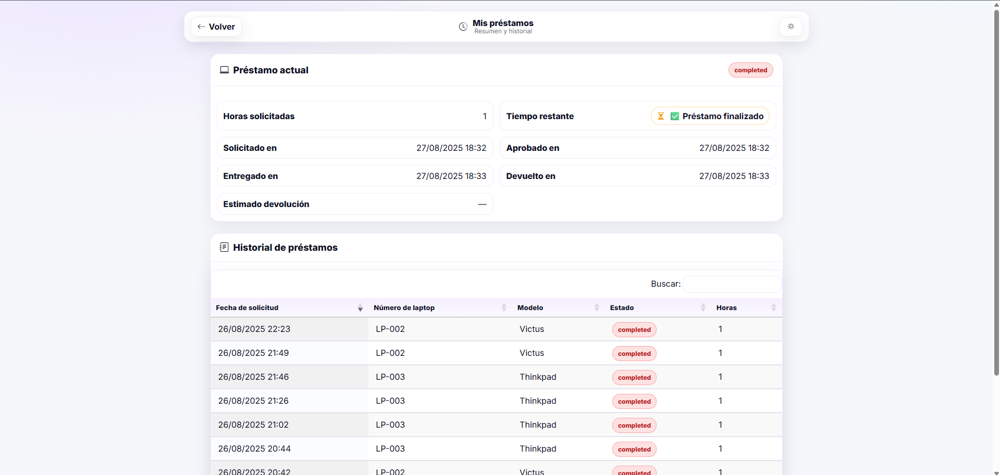
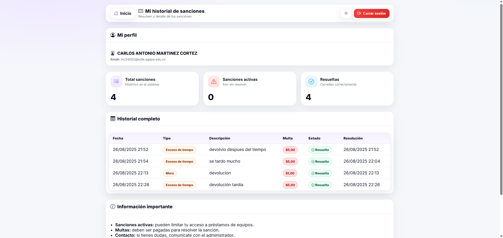
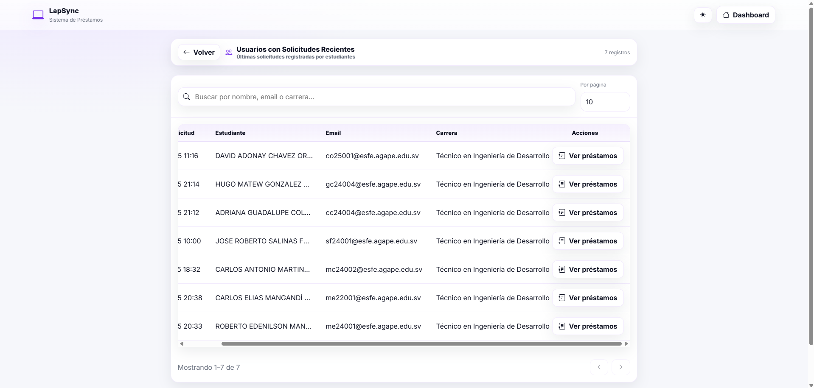
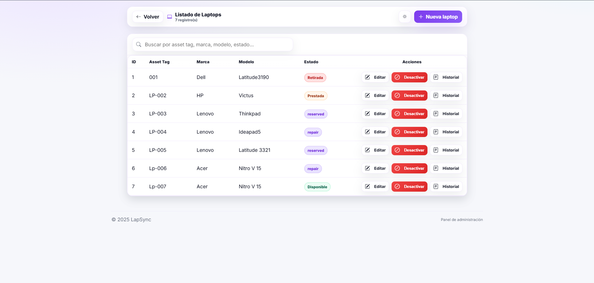
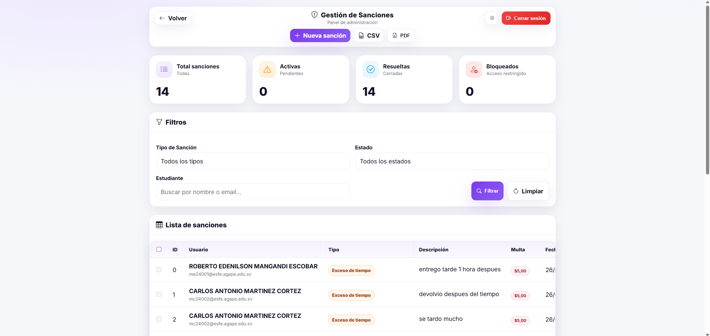
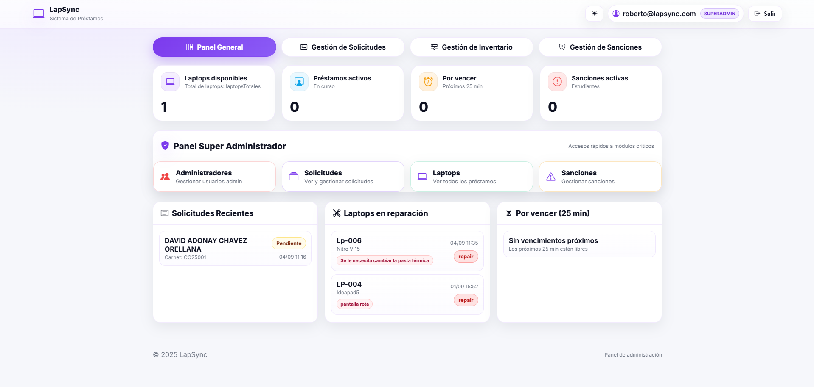
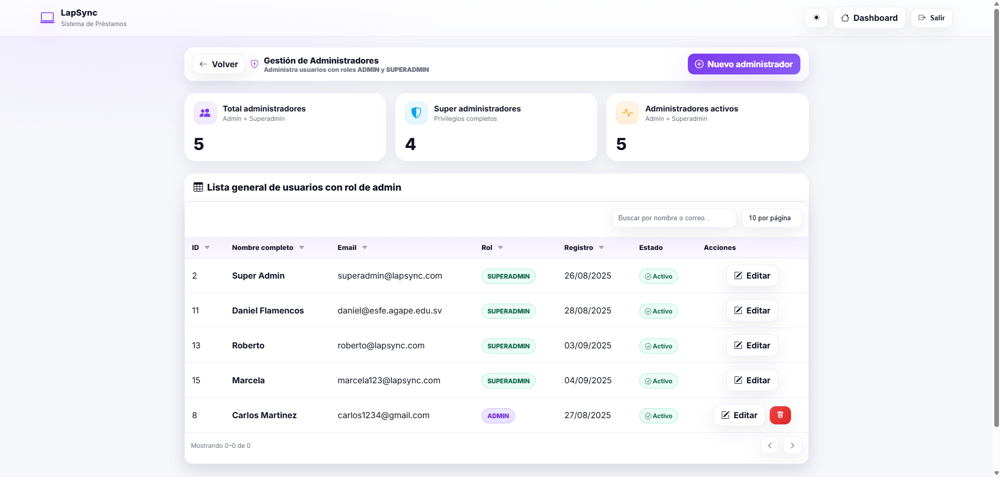

# 💻 LapSync — Plataforma Web para la Gestión de Préstamos de Laptops 🎓

*LapSync* es una aplicación web desarrollada con **Spring Boot** y **Thymeleaf** para optimizar el proceso de **préstamo de laptops** dentro de instituciones educativas.  
Está diseñada para estudiantes, administradores y superadministradores, facilitando la gestión de solicitudes, seguimientos, sanciones y control de equipos.

---

## 🛠️ Tecnologías Utilizadas

<p>
  
  
  
  
  
  
  
</p>

---

## ✨ Características Principales

- 🔐 **Autenticación con Google**: acceso seguro usando correos institucionales.
- 📦 **Gestión de préstamos**: solicitud, seguimiento y estados en tiempo real.
- ⚠️ **Control de sanciones**: registro automático de infracciones y penalizaciones.
- 🧰 **Panel administrativo**: control de laptops, usuarios y sanciones.
- 👑 **Rol Super Admin**: gestión completa del sistema y creación de administradores.
- 📊 **Interfaz moderna y responsiva** gracias a Thymeleaf y Bootstrap.

---

## 👤 Roles de Usuario

- 👨‍🎓 **Estudiante:** Solicita laptops, revisa el estado de sus préstamos y consulta sanciones.
- 👨‍💼 **Administrador:** Gestiona el inventario, solicitudes, devoluciones y sanciones.
- 👑 **Super Administrador:** Control total del sistema y creación de nuevos administradores.

---

## 🖼️ Galería

> Vista rápida de 4 pantallas clave. Abre cada sección para ver más por rol.

**Login**  


**Panel Estudiante**  


**Solicitud de préstamo**  


**Mis préstamos**  


---

### Estudiante
<details open>
  <summary><strong>Ver todas las pantallas del Estudiante</strong></summary>
  <br/>

  <div align="center">
    <figure style="display:inline-block; margin:6px; text-align:center;">
      
      <figcaption>Login</figcaption>
    </figure>
    <figure style="display:inline-block; margin:6px; text-align:center;">
      
      <figcaption>Inicio / Panel</figcaption>
    </figure>
    <figure style="display:inline-block; margin:6px; text-align:center;">
      
      <figcaption>Solicitud</figcaption>
    </figure>
    <figure style="display:inline-block; margin:6px; text-align:center;">
      
      <figcaption>Mis préstamos</figcaption>
    </figure>
    <figure style="display:inline-block; margin:6px; text-align:center;">
      
      <figcaption>Mis sanciones</figcaption>
    </figure>
  </div>
</details>

### Administrador
<details>
  <summary><strong>Ver pantallas del Administrador</strong></summary>
  <br/>
  <div align="center">
    <figure style="display:inline-block; margin:6px; text-align:center;">
      
      <figcaption>Préstamos</figcaption>
    </figure>
    <figure style="display:inline-block; margin:6px; text-align:center;">
      
      <figcaption>Inventario</figcaption>
    </figure>
    <figure style="display:inline-block; margin:6px; text-align:center;">
      
      <figcaption>Sanciones</figcaption>
    </figure>
  </div>
</details>

### Super Administrador
<details>
  <summary><strong>Ver pantallas del Super Administrador</strong></summary>
  <br/>
  <div align="center">
    <figure style="display:inline-block; margin:6px; text-align:center;">
      
      <figcaption>Home</figcaption>
    </figure>
    <figure style="display:inline-block; margin:6px; text-align:center;">
      
      <figcaption>Administradores</figcaption>
    </figure>
  </div>
</details>

---

## ⚙️ Configuración del Proyecto

### 📦 Requisitos Previos
- ☕ Java 17+
- 🧰 Maven 3.9+
- 🐘 SQL Server instalado
- 🔑 Credenciales de Google OAuth2 configuradas

### ⚙️ Configuración de `application.properties`

```properties
spring.datasource.url=jdbc:sqlserver://localhost:1433;databaseName=lapsync
spring.datasource.username=usuario
spring.datasource.password=clave

spring.jpa.hibernate.ddl-auto=update
spring.jpa.show-sql=true

spring.security.oauth2.client.registration.google.client-id=TU_CLIENT_ID
spring.security.oauth2.client.registration.google.client-secret=TU_CLIENT_SECRET
```

⚠️ **Importante:** Crea la base de datos manualmente antes de ejecutar el proyecto.
```sql
CREATE DATABASE lapsync;
```

---

## 🚀 Ejecución del Proyecto

1. Clonar el repositorio:
```bash
git clone https://github.com/CarlosMartinezDev20/Lapsync.git
cd LapSync
```
2. Ejecutar la aplicación:
```bash
./mvnw spring-boot:run
```
3. Abrir en el navegador:
```
http://localhost:8080/login
```
4. ⚠️ Crear usuario `SUPER_ADMIN` en la base de datos para acceder al panel administrativo:
```sql
INSERT INTO usuarios (nombre, email, rol) 
VALUES ('Administrador Principal', 'admin@tu-dominio.com', 'SUPER_ADMIN');
```

---

## 🧪 Pruebas
```bash
./mvnw test
```

---

## 📍 Roadmap
- 📩 Notificaciones automáticas por correo.
- 📊 Generación de reportes PDF/CSV.
- 📱 PWA / Modo móvil.
- 🧾 Auditoría de acciones administrativas.

---

## 📜 Licencia
Este proyecto está bajo la licencia **MIT**. Puedes usarlo, modificarlo y distribuirlo libremente con fines académicos o personales.


💡 *LapSync busca mejorar el acceso a la tecnología en entornos educativos, simplificando el proceso de préstamos de equipos y creando una experiencia moderna, fluida y segura para todos los usuarios.*
